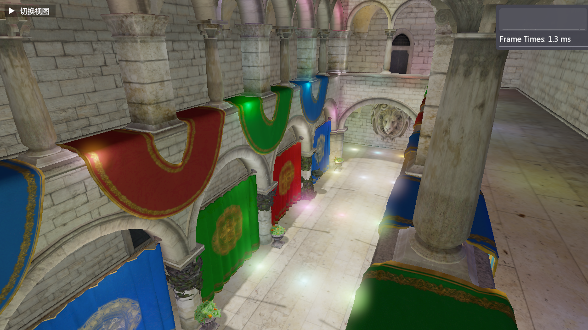

# 羲和 (Xi He)

[English](./README_en.md) | [中文](./README.md)

## 概述

羲和是按照《Mastering Graphics Programming with Vulkan》一书的思路开发，整合了最先进技术的现代渲染引擎。

### 已实现功能

#### 核心技术
- **渲染依赖图 (RDG)**：自动管理资源依赖、自动处理 barrier 和信号量、灵活添加渲染 pass
- **无绑定渲染**
- **多线程命令记录**
- **异步计算**
- **Mesh Shader 几何管线**
- **GPU 剔除**
- **管线自动化与缓存**

#### 渲染功能
- **延迟渲染**
- **分簇延迟光照**
- **级联阴影映射**
- **泛光**

### 待实现功能

- Mesh Shader 阴影
- 可变速率着色 (VRS)
- 体积雾
- 时间抗锯齿 (TAA)
- 全局光照 (GI)

## 效果展示

## 许可证

本项目采用 MIT 许可证。
- Vulkan 后端参考了 [KhronosGroup/Vulkan-Samples](https://github.com/KhronosGroup/Vulkan-Samples)（Apache License 2.0）的概念与源码，在理解源码的基础上使用vulkan-hpp重新实现，核心技术中只有管线自动化与缓存来自该项目。
