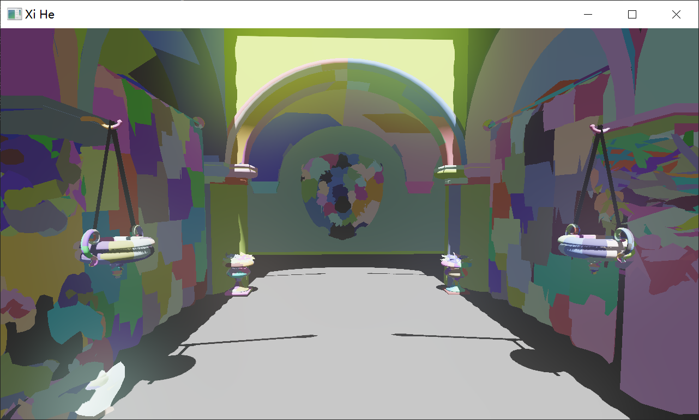

# Xi He (羲和)

[English](./README_en.md) | [中文](./README.md)

## Overview

Xi He is a modern rendering engine developed following the approach outlined in "Mastering Graphics Programming with Vulkan" by Marco Castorina and Gabriel Assone, incorporating cutting-edge technologies.

### Implemented Features

#### Core Technologies
- **Render Dependency Graph (RDG)**: Automatic resource dependency management, barrier and semaphore handling, flexible render pass addition
- **Bindless Rendering**
- **Multi-threaded Command Recording**
- **Async Compute**
- **Mesh Shader Pipeline**
- **GPU Culling**
- **Pipeline Automation and Caching**

#### Rendering Features
- **Deferred Rendering**
- **Cascaded Shadow Mapping**
- **Bloom**

### Planned Features

- Clustered Deferred Rendering
- Mesh Shader Shadows
- Variable Rate Shading (VRS)
- Volumetric Fog
- Temporal Anti-aliasing (TAA)
- Global Illumination (GI)

## Gallery

## License

This project is licensed under the MIT License.
- The Vulkan backend references concepts and code from [KhronosGroup/Vulkan-Samples](https://github.com/KhronosGroup/Vulkan-Samples) (Apache License 2.0), reimplemented using vulkan-hpp after thorough understanding of the source code. Among the core technologies, only pipeline automation and caching are derived from this codebase.
